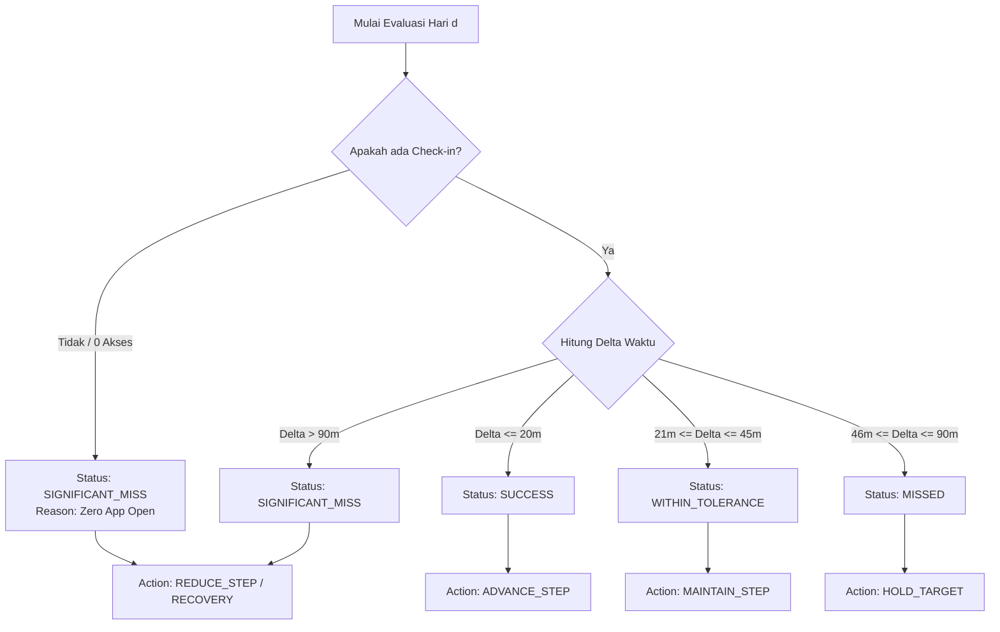

# Project Chronos — Adaptive Transition Engine Specification

| Metadata | Detail |
| :--- | :--- |
| **Document Type** | Algorithmic & Logic Engine Specification |
| **Version** | `1.0.0` |
| **Status** | Approved Blueprint |
| **Component** | `Backend/engine/` & `Mobile/domain/engine/` |
| **Reference** | [`PRD.md`](file:///c:/Users/user/Nata/Project/Adaptive%20Lifestyle%20Transition%20System/.agents/docs/prd/PRD.md) & [`ARCHITECTURE.md`](file:///c:/Users/user/Nata/Project/Adaptive%20Lifestyle%20Transition%20System/.agents/docs/architecture/ARCHITECTURE.md) |

---

## 1. Engine Overview & Architecture Isolation

**Adaptive Transition Engine** adalah komponen inti murni (*pure deterministic logic*) yang bertugas:
1. Menilai kelayakan target (*Feasibility Evaluation*).
2. Menghasilkan roadmap tahapan transisi (*Roadmap Generation*).
3. Menyusun rencana to-do harian tanpa tabrakan jadwal (*Daily Plan Scheduling & Constraint Resolution*).
4. Menganalisis deviasi eksekusi harian (*Daily Deviation Analysis*).
5. Mengambil keputusan adaptasi (*Closed-Loop Adaptation Controller*).

Engine ini dirancang **terisolasi dari dependensi database I/O langsung** agar dapat diuji 100% menggunakan automated unit tests dan dapat dijalankan di sisi backend maupun offline di mobile client.

---

## 2. Mathematical Formulas & Step Sizing Algorithms

### 2.1 Feasibility Assessment Formula
Sebelum roadmap dibuat, engine memvalidasi apakah perpindahan waktu tidur/bangun dapat dicapai dalam durasi yang diminta:

$$\Delta T_{\text{total}} = |T_{\text{baseline}} - T_{\text{target}}| \quad (\text{dalam menit})$$

$$\text{Max Step Sizing Safe} = 15 \text{ menit per } 2 \text{ hari} = 7.5 \text{ menit/hari}$$

$$\text{Minimum Days Required} = \left\lceil \frac{\Delta T_{\text{total}}}{7.5} \right\rceil$$

- Jika $\text{Requested Duration (Days)} < \text{Minimum Days Required}$, sistem mengeluarkan saran:
  - **Saran A**: Perpanjang durasi ke $\text{Minimum Days Required}$.
  - **Saran B**: Kurangi lompatan target ke batas aman pertama (Fase 1 Target).

### 2.2 Dynamic Step Sizing Progression
Untuk roadmap normal, pergeseran target waktu harian ($\delta_d$) diatur bertahap:

$$T_{\text{target}}(d) = T_{\text{baseline}} - \sum_{i=1}^{d} \text{StepSize}(i)$$

Besaran langkah standar ($\text{StepSize}$):
- **Normal Rate**: 15 menit pergeseran setiap 2 hari sukses.
- **Conservative Rate (setelah deviasi)**: 10 menit pergeseran setiap 3 hari sukses.

---

## 3. Daily Evaluation & State Machine

Setiap hari $d$, setelah pengguna melakukan check-in atau pada cut-off waktu evaluasi, engine menghitung deviasi waktu bangun:

$$\Delta_{\text{wake}} = |T_{\text{actual}} - T_{\text{target}}| \quad (\text{menit})$$



### 3.1 Matriks Aturan Adaptasi (Adaptation Rule Matrix)

| State Evaluasi Hari $d$ | Kondisi Historis ($d-1, d-2$) | Keputusan Hari $d+1$ | Deskripsi Logika |
| :--- | :--- | :--- | :--- |
| **SUCCESS** | Apapun | `ADVANCE_STEP` | Lanjutkan roadmap, kurangi waktu bangun sebesar $\text{StepSize}$ normal. |
| **WITHIN_TOLERANCE** | Success / Tolerance | `MAINTAIN_STEP` | Pertahankan target hari ini untuk 1 hari tambahan sebelum maju. |
| **MISSED** | 1x Missed | `HOLD_TARGET` | Target waktu bangun hari esok disamakan dengan target hari ini (tidak ada kenaikan kesulitan). |
| **MISSED** | 2x Missed berturut-turut | `REDUCE_STEP_SIZE` | Kecilkan besaran pergeseran target berikutnya (dari 15 menit menjadi 10 menit). |
| **SIGNIFICANT_MISS** | 1x (>90m / 0 open) | `ENTER_RECOVERY` | Sederhanakan to-do harian (hanya 1 target utama), tahan target waktu pada titik baseline terdekat. |

---

## 4. Budget Re-Balancing Algorithm

Setiap kali pengguna mencatat pengeluaran aktual untuk sesi makan $m$, engine memperbarui neraca anggaran mingguan:

$$\text{Remaining Budget} = \text{Weekly Budget} - \sum \text{Actual Spending}$$

$$\text{Remaining Days} = \text{Total Days} - \text{Current Day}$$

$$\text{New Daily Budget Cap} = \frac{\text{Remaining Budget}}{\text{Remaining Days}}$$

Jika $\text{New Daily Budget Cap} < \text{Minimum Meal Threshold}$ (misal Rp10.000/sesi makan), sistem mengeluarkan rekomendasi adaptif untuk menyederhanakan opsi menu makan tanpa membebani keuangan pengguna.

---

## 5. Schedule Constraint Collision Resolver

Sebelum merilis to-do harian ke UI pengguna, engine menjalankan algoritma **Interval Collision Check**:

```python
# Pseudo-code representasi logika resolver
def resolve_plan_schedule(planned_items, user_constraints):
    for item in planned_items:
        for constraint in user_constraints:
            if intervals_overlap(item.start_time, item.end_time, constraint.start_time, constraint.end_time):
                # Geser waktu to-do ke buffer terdekat yang valid
                item.start_time = find_next_available_slot(constraint.end_time, buffer_minutes=15)
    return planned_items
```

---

## 6. Unit Testing Scenarios (Mandatory Engine Tests)

1. **Test Feasibility Rejection**: Memastikan engine menolak durasi 3 hari untuk pergeseran tidur 6 jam.
2. **Test Consecutive Miss Adaptation**: Memastikan 2x `MISSED` berturut-turut memicu `REDUCE_STEP_SIZE`.
3. **Test Zero App Open Handling**: Memastikan hari tanpa akses menandai seluruh item sebagai `MISSED` dan memicu mode pemulihan secara halus.
4. **Test Midnight Rollover Calculation**: Memastikan waktu tidur jam 02.00 AM dihitung sebagai siklus tidur malam yang benar.
5. **Test Budget Dynamic Cap**: Memastikan overspending pada hari Senin mengurangi batas anggaran harian untuk hari Selasa hingga Minggu secara presisi.
