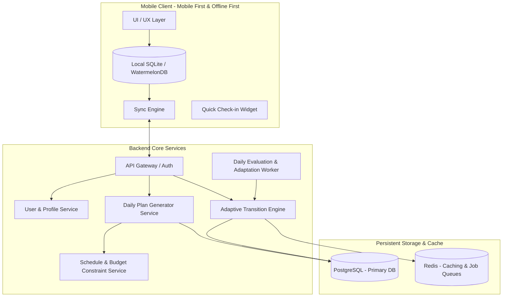
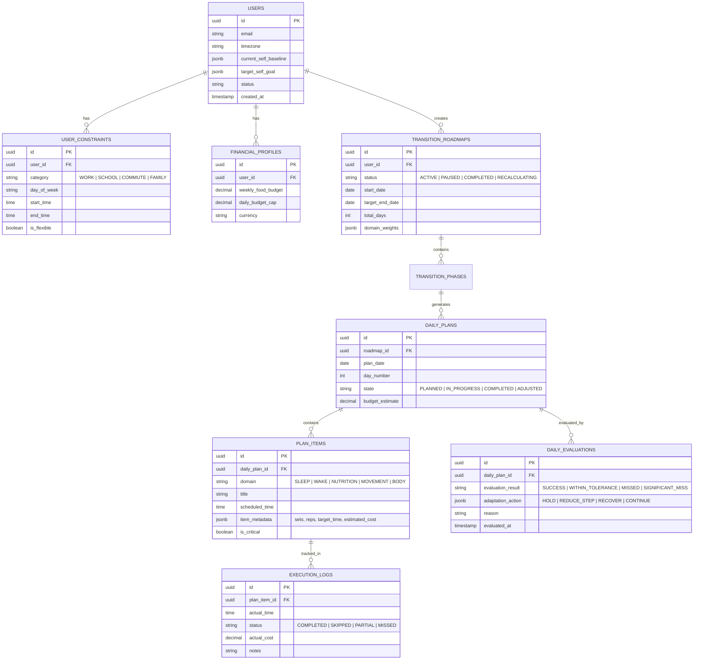
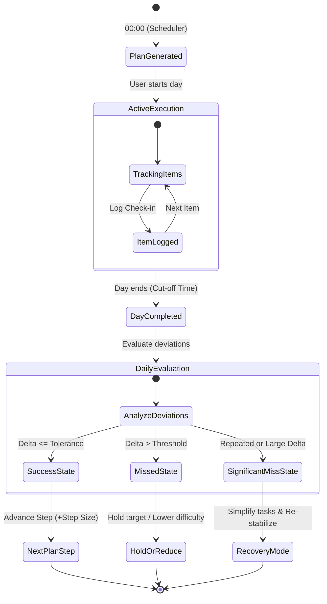

# Project Chronos — System Architecture & Technical Design

**Document Version:** 1.0.0  
**Status:** Architectural Blueprint  
**Reference Document:** [`PRD.md`](file:///c:/Users/user/Nata/Project/Adaptive%20Lifestyle%20Transition%20System/.agents/docs/prd/PRD.md)  
**System Category:** Adaptive Lifestyle Transition Engine & Mobile Companion  

---

## 1. High-Level System Architecture

Project Chronos beroperasi menggunakan arsitektur **Client-Server Event-Driven Closed-Loop System**. Arsitektur ini dirancang untuk memproses siklus hidup pengguna secara adaptif: dari Assessment, Roadmap Generation, Daily Plan Scheduling, Frictionless Tracking, hingga Dynamic Plan Adaptation.

---

## 2. Core Architectural Components

### 2.1 Mobile Client Architecture (Mobile-First)
- **Offline-First & Local Cache**: Seluruh daily plan di-cache di local storage perangkat (e.g. SQLite / WatermelonDB). User dapat melakukan check-in dan melihat plan tanpa ketergantungan koneksi internet real-time.
- **Frictionless Quick Check-in**:
  - Durasi interaksi ditargetkan **< 10 detik** ("Open -> Understand -> Check-in -> Close").
  - Optimistic UI updates untuk setiap status tugas (Tidur, Bangun, Makan, Olahraga).
- **Timezone & Local Alarm Sync**: Menyesuaikan reminder harian dan target waktu (misal: waktu tidur 02.45, bangun 09.30) dengan timezone lokal perangkat pengguna.

### 2.2 Adaptive Transition Engine (Core Brain)
Komponen ini adalah pembeda utama Chronos dibandingkan habit tracker konvensional.
- **Baseline Ingestion**: Membaca Current Self (baseline tidur, bangun, frekuensi makan, pengeluaran).
- **Feasibility Evaluator**: Menilai apakah durasi yang diminta (misal: 4 minggu) realistis untuk melompat dari kondisi awal ke target. Jika terlalu curam, sistem menyarankan penyesuaian durasi atau membaginya ke dalam beberapa fase (Step Sizing).
- **Closed-Loop Adaptation Controller**:
  - Menerima hasil tracking harian (`SUCCESS`, `WITHIN_TOLERANCE`, `MISSED`, `SIGNIFICANT_MISS`).
  - Mengambil keputusan adaptasi: `CONTINUE_PROGRESSION`, `HOLD_TARGET`, `REDUCE_STEP_SIZE`, `REDUCE_DAILY_LOAD`, atau `ENTER_RECOVERY`.
- **Constraint Matrix Resolver**: Memastikan rencana tidak pernah bertabrakan dengan jadwal wajib (Kuliah/Kerja/Commute) dan tidak melebihi alokasi budget harian.

---

## 3. Data Model & Schema Design

---

## 4. State Machine: Adaptive Plan Lifecycle

Setiap hari pengguna melewati siklus status transisi:

### 4.1 Logika Adaptasi (Adaptation Strategies)
1. **Continue Progression**:
   - Jika target tercapai atau dalam batas toleransi (misal selisih bangun < 15 menit), lanjutkan roadmap ke step berikutnya.
2. **Hold Target**:
   - Jika pengguna meleset 1 kali, jangan langsung menaikkan kesulitan. Pertahankan target yang sama untuk hari berikutnya agar ritme stabil.
3. **Reduce Step Size**:
   - Jika meleset berturut-turut (misal 2 hari), kecilkan lompatan perubahan (misal dari target maju 30 menit menjadi hanya 10 menit).
4. **Enter Recovery Mode**:
   - Jika terjadi significant miss (misal sakit atau jadwal berantakan), kurangi beban aktivitas harian ke level minimum (survival routine) tanpa memutus riwayat dan tanpa pesan yang menghakimi (non-judgmental).

---

## 5. Safety, Budget, & Resource Guardrails

1. **Safety Boundaries**:
   - Tidak memperbolehkan defisit/surplus kalori ekstrem atau pemotongan jam tidur di bawah batas aman medis (>6 jam tidur minimum).
   - Menolak target yang tidak realistis secara fisiologis (misal: perubahan bangun 6 jam lebih awal dalam 2 hari).
2. **Budget Guardrail**:
   - Rekomendasi makanan tidak boleh melebihi budget harian (Weekly Budget / 7).
   - Jika ada hari yang overbudget, sistem otomatis menyesuaikan rekomendasi hari berikutnya agar total mingguan tetap seimbang.
3. **Resource Guardrail**:
   - Memfilter workout berdasarkan input fasilitas (No Gym, No Equipment, Small Room).

---

## 6. Recommended Technology Stack

| Layer | Rekomendasi Teknologi | Alasan Pemilihan |
| :--- | :--- | :--- |
| **Mobile Client** | **Flutter** (atau React Native / Expo) | Performa native, kemudahan build cross-platform (Android/iOS), dukungan local storage offline yang matang. |
| **Backend API** | **FastAPI / Node.js (NestJS / Hono)** | Ringan, eksekusi kalkulasi algoritma cepat, mendukung type safety tinggi, dan integrasi mudah dengan worker. |
| **Database** | **PostgreSQL** | Relasional yang handal untuk constraint model, JSONB support untuk fleksibilitas metadata roadmap dan evaluasi. |
| **Caching & Workers** | **Redis + BullMQ / Celery** | Menangani background evaluation setiap pergantian hari (midnight evaluation worker) dan push reminders. |
| **Local Database** | **SQLite / WatermelonDB** | Menjamin aplikasi tetap responsif instan dan offline-ready. |

---

## 7. Implementation Phasing

1. **Phase 1 (Foundation & Schema)**: Inisiasi database models, User Life Profile, dan Constraint Matrix.
2. **Phase 2 (Adaptive Engine Core)**: Implementasi Roadmap Generator & Daily Plan Evaluator.
3. **Phase 3 (Mobile Client Core)**: Pembuatan UI Onboarding (Current Self vs Target Self), Daily Plan View, dan Fast Check-in.
4. **Phase 4 (Adaptation Loop & Notifications)**: Background Worker untuk Midnight Evaluation, Push Reminder, dan Recovery Trigger.
