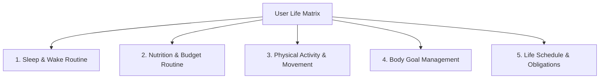
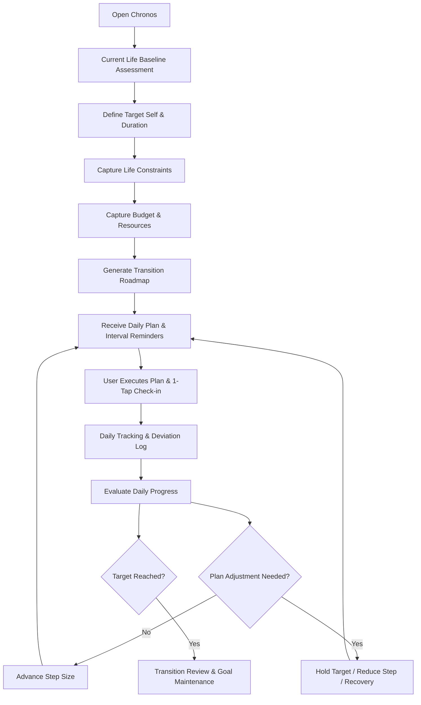

# Project Chronos — Product Requirements Document (PRD)

| Metadata | Detail |
| :--- | :--- |
| **Project Title** | Project Chronos (Adaptive Lifestyle Transition System) |
| **Author / Contributor** | **Rahmat Hadinata** ([@RahmatHadinata23758051](https://github.com/RahmatHadinata23758051)) |
| **Repository** | [`Project-Lifestyle-Adaptive-Transition`](https://github.com/RahmatHadinata23758051/Project-Lifestyle-Adaptive-Transition.git) |
| **Document Type** | Project Initiation / Product Definition |
| **Version** | `0.2.0` (Polished & Decision Aligned) |
| **Status** | Approved Specification |
| **Platform Focus** | Mobile Application (Mobile-First, Offline-First) |
| **Development Context** | Antigravity IDE |
| **Last Updated** | 18 August 2026 |

---

## 1. Executive Summary

**Project Chronos** adalah aplikasi mobile pendamping transisi gaya hidup adaptif yang membantu pengguna bergerak secara bertahap dari rutinitas hidup mereka saat ini (*Current Self*) menuju kondisi hidup yang diinginkan (*Target Self*), tanpa mengorbankan kewajiban utama seperti sekolah, kuliah, pekerjaan, kegiatan keluarga, maupun aktivitas penting lainnya.

Chronos tidak dibangun sebagai habit tracker biasa yang hanya mencatat apakah suatu aktivitas selesai atau tidak. Chronos bertindak sebagai **Personal Lifestyle Transition Mentor** yang memahami kondisi awal pengguna, target, jadwal wajib (*hard constraints*), kemampuan finansial (*budget awareness*), keterbatasan fasilitas/alat, dan perkembangan harian pengguna untuk kemudian membentuk rencana (*plan*) yang realistis dan dapat disesuaikan.

Perubahan yang didorong Chronos tidak dilakukan secara drastis semalam. Sistem menggunakan pendekatan **Progressive Transition**, yaitu memecah perubahan besar menjadi langkah-langkah kecil (*micro-steps*) yang dapat dipertahankan dalam kehidupan nyata.

### Contoh Kasus Transisi Nyata
- **Kondisi Awal**: Pengguna terbiasa tidur pukul 04.00 dan bangun pukul 13.00.
- **Target Pengguna**: Bangun sekitar pukul 06.00 dalam beberapa minggu ke depan.
- **Kewajiban Nyata**: Memiliki jadwal kuliah/kerja pagi yang wajib dihadiri.
- **Pendekatan Chronos**: Tidak memaksa pengguna tidur pukul 22.00 pada hari pertama. Chronos membentuk jalur transisi bertahap (misal mundur 30 menit per beberapa hari), memantau realisasi harian, lalu menyesuaikan rencana berdasarkan respons fisiologis dan kepatuhan pengguna.

---

## 2. Product Vision

Membantu pengguna memperbaiki kualitas hidup dari rutinitas yang sedang dijalani saat ini menuju kondisi yang diinginkan melalui perubahan kecil, realistis, adaptif, dan selaras dengan batasan nyata kehidupan pengguna.

> **Prinsip Visi:** Chronos tidak bertujuan membuat pengguna memiliki "rutinitas sempurna instan", melainkan membantu pengguna membangun rutinitas yang lebih baik dan dapat dipertahankan secara konsisten.

---

## 3. Product Thesis

Masalah mendasar yang diselesaikan Chronos adalah **ketidakselarasan antara kondisi hidup saat ini (*Current Self*) dengan tuntutan atau target masa depan (*Target Self*)**:
- Bangun terlalu siang sementara jam kuliah/kerja dimulai pagi.
- Pola tidur tidak teratur sehingga fokus aktivitas utama terganggu.
- Ingin menaikkan atau menurunkan berat badan tetapi jadwal makan tidak konsisten.
- Ingin mulai berolahraga tetapi tidak memiliki akses gym, waktu luang panjang, atau alat fitness.
- Ingin makan teratur tetapi memiliki anggaran keuangan yang terbatas.
- Terjebak dalam siklus perubahan drastis yang berujung pada kelelahan (*burnout*) dan kegagalan.

Chronos hadir sebagai jembatan adaptif di antara kedua kondisi tersebut.

---

## 4. Core Product Philosophy

### 4.1 Current Life First
Chronos wajib memahami pola hidup pengguna saat ini sebelum menyusun rekomendasi. Sistem tidak boleh berasumsi bahwa semua orang memiliki jam tidur yang sama, bisa pergi ke gym, atau memiliki waktu luang berlebih.

### 4.2 Transition, Not Transformation Overnight
Perubahan dilakukan melalui siklus:
1. Penentuan baseline (*Baseline Setting*).
2. Langkah perubahan bertahap (*Micro-Steps*).
3. Eksekusi harian (*Daily Execution*).
4. Observasi & Pelaporan (*Tracking & Check-in*).
5. Evaluasi deviasi (*Deviation Analysis*).
6. Penyesuaian rencana otomatis (*Adaptive Adjustment*).
7. Progres ke fase berikutnya (*Progression*).

### 4.3 Life Constraints Must Be Respected
Rencana harus dibangun mengelilingi kehidupan pengguna, bukan memaksa kehidupan pengguna mengelilingi aplikasi. Batasan mencakup:
- Jam sekolah / kuliah / praktikum.
- Jam kerja kantor / kerja shift / lembur.
- Waktu perjalanan (*commute*).
- Waktu ibadah dan kegiatan keluarga.
- Kemampuan memasak dan ketersediaan dapur.
- Fasilitas olahraga dan kondisi anggaran.

### 4.4 Budget-Aware by Design
Anggaran bukan sekadar catatan pasif, melainkan batasan utama (*hard constraint*):
- Alokasi anggaran makan mingguan (misal Rp350.000/minggu) secara otomatis dibagi ke dalam batas harian.
- Sistem tidak akan merekomendasikan rencana yang menuntut biaya di luar batas kemampuan finansial pengguna.
- *Prinsip:* **"A good plan that cannot be afforded is not a good plan."**

### 4.5 Progress Over Perfection (Failure as Information)
Chronos menolak sistem biner yang menghukum (*Completed = Sukses, Missed = Hukuman/Streak Broken*). Kegagalan atau deviasi waktu dianggap sebagai data input untuk penyesuaian:
- **Tercapai**: Target terlaksana dalam batas toleransi.
- **Dalam Toleransi**: Sedikit bergeser dari target, tetap dihitung sebagai progres.
- **Meleset (*Missed*)**: Deviasi signifikan yang direspons dengan menahan target (*hold target*).
- **Meleset Signifikan (*Significant Miss*)**: Tidak ada akses/kegagalan beruntun yang direspons dengan memperkecil *step size* atau mengaktifkan mode pemulihan (*recovery mode*).

---

## 5. Target User & Persona Model

Sistem menerapkan **Unified Constraint-Driven Profile** yang dapat dikonfigurasi untuk:
1. **Mahasiswa / Pelajar**: Jam tidur bergeser, kelas pagi, anggaran terbatas, fasilitas kos sederhana.
2. **Remote Worker / Freelancer / Developer**: Jam kerja fleksibel, minim aktivitas fisik, pola makan tidak teratur.
3. **Pekerja Shift / Karyawan**: Jam kerja rotasi yang menuntut penyesuaian jam tidur dinamis.

---

## 6. Core Lifestyle Domains

### 6.1 Sleep & Wake Routine
- Membantu transisi waktu mulai tidur, waktu bangun, dan konsistensi istirahat.
- Mendukung penanganan penyeberangan tengah malam (*midnight rollover*).

### 6.2 Nutrition & Budget Routine
- Pendekatan berbasis sesi makan terjadwal (Sarapan, Makan Siang, Snack, Makan Malam).
- Check-in 1-tap tanpa beban hitung kalori atau timbang gram.
- Pelacakan pengeluaran aktual dan penyeimbangan otomatis sisa anggaran harian/mingguan.

### 6.3 Physical Activity & Movement
- Rutinitas mikro 3-tingkat (5–20 menit) berbiaya nol (bodyweight, stretching, jalan kaki).
- Bebas dari keharusan membership gym atau alat mahal.

### 6.4 Body Goal Management
- Peningkatan, penurunan, atau pemeliharaan berat badan bertahap.
- Fokus pada tren perubahan jangka menengah, bukan fluktuasi air harian.

### 6.5 Life Schedule & Obligations
- Matriks jadwal wajib mingguan yang menjadi batas waktu tertutup bagi generator to-do.

---

## 7. Ambang Batas Evaluasi Harian (Daily Evaluation Thresholds)

Berdasarkan keputusan desain, evaluasi deviasi waktu bangun dan tidur diatur sebagai berikut:

| Kategori Status | Deviasi Waktu Aktual vs Target | Aksi Adaptive Engine |
| :--- | :--- | :--- |
| **Success** | $\le$ 20 menit | Lanjutkan progresi langkah berikutnya (*Advance Step*). |
| **Within Tolerance** | 21 – 45 menit | Pertahankan progres wajar, catat deviasi ringan. |
| **Missed** | 46 – 90 menit | Tahan target (*Hold Target*) pada tingkat kesulitan yang sama. |
| **Significant Miss** | > 90 menit / Tanpa Check-in | Perkecil ukuran langkah (*Reduce Step Size*) atau masuk *Recovery Mode*. |

---

## 8. Aturan Notifikasi, Absensi, & Keterlambatan

1. **Notifikasi Berinterval (*Interval Reminders*)**:
   - Sistem mengirimkan pengingat lokal berjenjang menjelang waktu aktivitas (misal: 15 menit dan 5 menit sebelum target sarapan atau persiapan tidur).
2. **Aturan Hari Absen (*Zero App Open*)**:
   - Jika pengguna sama sekali tidak membuka aplikasi selama 1 hari penuh, seluruh to-do hari tersebut otomatis berstatus `MISSED`.
   - Evaluasi harian mencatat absensi ini dan menyapa pengguna di hari berikutnya dengan rencana adaptif yang disederhanakan (*non-judgmental greeting*).
3. **Status Keterlambatan (*Late Check-in*)**:
   - Jika check-in dilakukan melewati batas toleransi jadwal, item dicatat dengan status `LATE_COMPLETED` agar riwayat eksekusi tetap tercatat akurat.

---

## 9. High-Level User Journey

---

## 10. Mobile-First & Interaction Principles

- **Interaksi Singkat (< 10 Detik)**: Alur utama adalah `Buka Aplikasi -> Pahami Rencana -> Check-in 1-Tap -> Tutup`.
- **Offline-First Ready**: Seluruh rencana tersimpan di database lokal perangkat sehingga tetap dapat diakses dan di-check-in tanpa sinyal internet.
- **Bahasa Non-Judgmental**: Tidak ada kata-kata kegagalan, hilangnya streak, atau pesan intimidatif.
- **Zero-AI-Slop**: Tampilan bersih tanpa gradasi klise, tanpa emoji di teks UI/log, dan tanpa elemen dekoratif kosong.

---

## 11. Batasan Produk (Product Boundaries)

### Chronos Adalah:
- Pendamping transisi gaya hidup adaptif (*Lifestyle Transition Mentor*).
- Mesin penjadwalan to-do harian berbasis batasan waktu dan anggaran nyata.
- Sistem pelacakan progres multi-domain yang memaafkan deviasi.

### Chronos Bukan:
- Aplikasi diagnosis medis atau terapi klinis.
- Pengganti dokter, psikiater, atau ahli gizi teregistrasi.
- Aplikasi penghitung kalori mikronutrien kompleks.
- Media sosial atau platform kompetisi/leaderboard.

---

## 12. Status & Roadmap Dokumen

| Dokumen Terkait | Status | Lokasi File |
| :--- | :--- | :--- |
| **PRD Inti** | `Approved v0.2.0` | [`PRD.md`](file:///c:/Users/user/Nata/Project/Adaptive%20Lifestyle%20Transition%20System/.agents/docs/prd/PRD.md) |
| **Arsitektur Sistem** | `Active Blueprint` | [`ARCHITECTURE.md`](file:///c:/Users/user/Nata/Project/Adaptive%20Lifestyle%20Transition%20System/.agents/docs/architecture/ARCHITECTURE.md) |
| **Spesifikasi Adaptive Engine** | `Drafting Next` | [`.agents/docs/architecture/ADAPTIVE_ENGINE_SPEC.md`](file:///c:/Users/user/Nata/Project/Adaptive%20Lifestyle%20Transition%20System/.agents/docs/architecture/ADAPTIVE_ENGINE_SPEC.md) |
| **Ruang Lingkup Produk (Scope)** | `Drafting Next` | [`.agents/docs/prd/PRODUCT_SCOPE.md`](file:///c:/Users/user/Nata/Project/Adaptive%20Lifestyle%20Transition%20System/.agents/docs/prd/PRODUCT_SCOPE.md) |
| **Aturan Anti-AI-Slop** | `Active Policy` | [`anti-ai-slop.md`](file:///c:/Users/user/Nata/Project/Adaptive%20Lifestyle%20Transition%20System/.agents/rules/anti-ai-slop.md) |