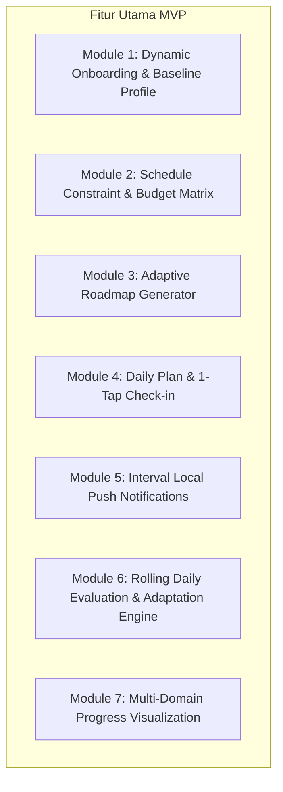

# Project Chronos — Product Scope & Feature Specification (MVP)

| Metadata | Detail |
| :--- | :--- |
| **Document Type** | Feature Scope & Acceptance Criteria |
| **Version** | `1.0.0` |
| **Status** | Approved Specification |
| **Reference** | [`PRD.md`](file:///c:/Users/user/Nata/Project/Adaptive%20Lifestyle%20Transition%20System/.agents/docs/prd/PRD.md) |

---

## 1. Executive Product Scope

Dokumen ini mengunci batasan fungsional untuk rilis **Minimal Viable Product (MVP)** Project Chronos. Fokus utama MVP adalah membuktikan alur transisi gaya hidup tertutup (*Closed-Loop Adaptive Transition*): **Assessment -> Roadmap -> Daily Plan -> Tracking/Check-in -> Evaluation -> Adaptation**.

---

## 2. In-Scope Modules & Features (MVP)

### Module 1: Dynamic Onboarding & Baseline Profile
- **Current Self Assessment**:
  - Jam tidur dan jam bangun saat ini.
  - Frekuensi makan harian saat ini (1, 2, atau 3+ kali).
  - Berat badan awal & objective (Weight Gain / Loss / Maintenance / Sleep Routine Only).
- **Target Self Definition**:
  - Target jam bangun dan target keteraturan tidur.
  - Durasi transisi yang diinginkan (e.g. 14 hari, 21 hari, 28 hari).
- **Feasibility Check**: Validasi kelayakan durasi terhadap besaran pergeseran jam tidur.

### Module 2: Schedule Constraint & Budget Matrix
- **Weekly Schedule Mapping**:
  - Input blok waktu wajib per hari (Senin - Minggu) untuk `Kuliah`, `Kerja`, `Commute`, `Ibadah`, `Personal`.
- **Financial Profile**:
  - Input alokasi anggaran makan mingguan (contoh: Rp350.000).
  - Pembagian otomatis menjadi anggaran rata-rata harian (`Weekly / 7`).
- **Resource Constraints**:
  - Ketersediaan dapur (Bisa masak / Hanya beli / Terbatas).
  - Akses olahraga (Tanpa alat / Ada dumbbell / Ada gym).

### Module 3: Adaptive Roadmap Generator
- Menghasilkan rangkaian tahapan (*phases*) dan langkah harian (*step sizes*).
- Menghitung pergeseran waktu tidur/bangun secara inkremental (misal: 15–30 menit per 2-3 hari).
- Menolak jadwal aktivitas yang berbenturan dengan `Schedule Constraints`.

### Module 4: Daily Plan & 1-Tap Check-in
- Menampilkan daftar to-do harian sederhana:
  - Sleep & Wake items (Target tidur & Target bangun).
  - Nutrition items (Sarapan, Makan Siang, Snack, Makan Malam) + Input pengeluaran aktual cepat.
  - Movement items (Micro-routine 5–20 menit).
- Check-in 1-tap: Konfirmasi selesai atau lewati.
- Interaksi dirancang selesai dalam waktu < 10 detik.

### Module 5: Interval Local Push Notifications
- Pengingat lokal terjadwal:
  - 15 menit & 5 menit sebelum jadwal makan.
  - 30 menit sebelum persiapan tidur (*wind-down time*).
  - Alarm/pengingat waktu bangun target.

### Module 6: Rolling Daily Evaluation & Adaptation Engine
- Evaluasi berjalan saat user melakukan check-in bangun pagi:
  - Deviasi $\le$ 20 menit -> `SUCCESS` (Lanjut step).
  - Deviasi 21–45 menit -> `WITHIN_TOLERANCE` (Pertahankan progres).
  - Deviasi 46–90 menit -> `MISSED` (Tahan target / *Hold Target*).
  - Deviasi > 90 menit atau 0 buka aplikasi -> `SIGNIFICANT_MISS` (Perkecil step size atau aktifkan *Recovery Mode*).
- Jika ada surplus atau defisit pengeluaran makan, alokasi sisa anggaran harian berikutnya dihitung ulang secara proporsional.

### Module 7: Multi-Domain Progress Visualization
- Grafik tren waktu bangun nyata vs target.
- Tren kepatuhan anggaran (pengeluaran kumulatif vs limit anggaran mingguan).
- Rasio konsistensi rutinitas tanpa konsep hukuman streak.

---

## 3. Explicit Out-of-Scope (Non-Goals untuk MVP)

Fitur-fitur berikut **tidak akan dibuat** pada fase MVP:
1. **Calorie & Macro Scanner / Database Makanan Ekstensif**: Tidak ada scan barcode atau timbang gram mikronutrisi.
2. **Social Media & Leaderboard**: Tidak ada fitur pertemanan, feed publik, atau papan kompetisi.
3. **Medical & Diagnostic Features**: Tidak ada analisis gangguan tidur klinis atau resep obat.
4. **Food Delivery / E-Commerce Integration**: Tidak ada integrasi pembelian makanan langsung dari aplikasi.
5. **Complex Wearable Sync**: Integrasi Apple Watch / Garmin / Fitbit ditunda ke fase rilis berikutnya.

---

## 4. User Acceptance Criteria (UAC Matrix)

| ID | User Story | Kriteria Keberhasilan (Acceptance Criteria) |
| :--- | :--- | :--- |
| **UAC-01** | Sebagai user, saya ingin memasukkan baseline hidup saya dan jadwal kuliah/kerja. | Sistem menyimpan baseline dan memastikan tidak ada rencana aktivitas yang bertabrakan dengan jadwal kuliah/kerja. |
| **UAC-02** | Sebagai user dengan budget terbatas, saya ingin rencana makan saya sesuai uang saya. | Sistem membatasi estimasi biaya makan harian $\le$ `Weekly Budget / 7` dan memperbarui sisa budget saat input pengeluaran aktual. |
| **UAC-03** | Sebagai user yang telat bangun, saya ingin sistem menyesuaikan rencana tanpa menghukum. | Sistem mencatat status deviasi waktu, tidak menampilkan pesan kegagalan, dan menahan target esok hari agar tetap realistis. |
| **UAC-04** | Sebagai user yang tidak membuka aplikasi kemarin, saya ingin rencana tetap berjalan. | Seluruh to-do kemarin ditandai `MISSED`, evaluasi mencatat absensi, dan rencana hari ini menyapa dengan mode penyesuaian yang disederhanakan. |
| **UAC-05** | Sebagai user tanpa kuota internet, saya ingin tetap bisa melihat to-do dan check-in. | Seluruh interaksi check-in harian berfungsi normal secara offline dan tersinkronisasi otomatis saat online kembali. |
