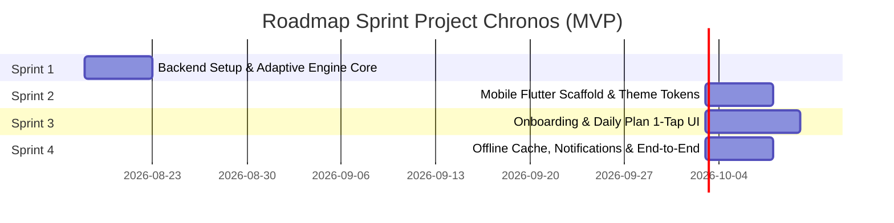

# Project Chronos — Master Product Backlog (Jira / Agile Epics)

Dokumen ini memetakan seluruh *Product Backlog* yang diturunkan dari [`PRD.md`](file:///c:/Users/user/Nata/Project/Adaptive%20Lifestyle%20Transition%20System/.agents/docs/prd/PRD.md) dan [`PRODUCT_SCOPE.md`](file:///c:/Users/user/Nata/Project/Adaptive%20Lifestyle%20Transition%20System/.agents/docs/prd/PRODUCT_SCOPE.md) ke dalam rangkaian Sprint terstruktur.

---

## 🗺️ Roadmap Sprint MVP

---

## 📦 Master Epics & User Stories

### EPIC 1: System Foundation & Pure Adaptive Engine (Sprint 1 - Active)
- **STORY-1.1**: Sebagai sistem, saya ingin memiliki skema data relasional untuk menyimpan profil hidup, batasan jadwal, dan log eksekusi.
- **STORY-1.2**: Sebagai pengguna, saya ingin sistem mengevaluasi apakah target waktu bangun saya realistis dengan durasi yang saya pilih.
- **STORY-1.3**: Sebagai pengguna, saya ingin sistem menyesuaikan target waktu bangun esok hari secara bertahap saat saya berhasil bangun tepat waktu.
- **STORY-1.4**: Sebagai pengguna, saya ingin sistem menahan tingkat kesulitan saat saya telat bangun tanpa menghakimi atau merusak streak.
- **STORY-1.5**: Sebagai pengguna, saya ingin sistem memastikan tidak ada rencana to-do yang bertabrakan dengan jam kuliah/kerja saya.
- **STORY-1.6**: Sebagai QA, saya ingin seluruh algoritma adaptasi memiliki test suite 100% lulus tanpa mock palsu.

---

### EPIC 2: Mobile Flutter Scaffold & Design System (Sprint 2 - Planned)
- **STORY-2.1**: Sebagai mobile engineer, saya ingin scaffold Flutter 3.x modular dengan Riverpod/Bloc dan offline SQLite/WatermelonDB.
- **STORY-2.2**: Sebagai UI designer, saya ingin tema mobile mematuhi aturan Zero-AI-Slop (tanpa gradasi ungu/neon AI, tipografi kontras tinggi, spatial layout bersih).
- **STORY-2.3**: Sebagai mobile engineer, saya ingin widget kartu dan list to-do memiliki visual bersih tanpa nesting card berlebih.

---

### EPIC 3: Dynamic Onboarding & Daily 1-Tap Check-in (Sprint 3 - Planned)
- **STORY-3.1**: Sebagai pengguna baru, saya ingin alur onboarding cepat untuk memasukkan jam tidur, jam bangun, jadwal wajib mingguan, dan budget makan.
- **STORY-3.2**: Sebagai pengguna harian, saya ingin melihat to-do hari ini dan melakukan check-in dalam waktu < 10 detik.
- **STORY-3.3**: Sebagai pengguna yang makan di luar, saya ingin mencatat pengeluaran aktual dengan cepat dan melihat sisa budget otomatis terbarui.

---

### EPIC 4: Interval Notifications, Offline Sync, & Polish (Sprint 4 - Planned)
- **STORY-4.1**: Sebagai pengguna, saya ingin pengingat lokal berbunyi 15 menit & 5 menit sebelum jadwal makan atau persiapan tidur.
- **STORY-4.2**: Sebagai pengguna tanpa internet, saya ingin tetap bisa membuka aplikasi dan mencatat to-do secara offline.
- **STORY-4.3**: Sebagai tim pengembang, saya ingin audit keamanan menyeluruh dan verifikasi anti-slop final sebelum rilis MVP.
