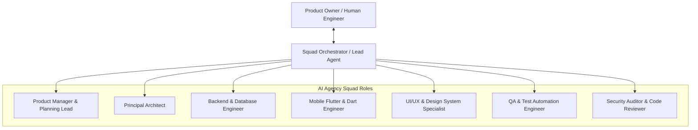
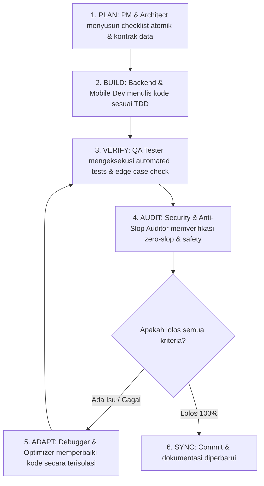

# Project Chronos — AI Agency Squad & Loop Engineering Manifest

Dokumen ini mendefinisikan struktur **AI Agency Team (Swarm / Squad)** dan implementasi **Loop Engineering** untuk pengembangan **Project Chronos**.

Setiap peran dalam squad dipetakan ke *global skills* yang telah terpasang di Antigravity, memastikan setiap fase (arsitektur, backend, mobile Dart, UI/UX, pengujian, audit keamanan, dan review) dieksekusi dengan standar tingkat lanjut tanpa AI slop.

---

## 1. 👥 Pemetaan Peran AI Agency Squad & Skills Terkait

---

### 1.1 Product Manager & Delivery Lead
- **Fokus**: Menjaga integritas PRD, dekomposisi task atomik, validasi kriteria penerimaan (UAC).
- **Skills Aktif**:
  - `product-manager-toolkit` (`C:\Users\user\.gemini\config\skills\product-manager-toolkit\SKILL.md`)
  - `concise-planning` (`C:\Users\user\.gemini\config\skills\concise-planning\SKILL.md`)
  - `writing-plans` (`C:\Users\user\.gemini\config\skills\writing-plans\SKILL.md`)
  - `executing-plans` (`C:\Users\user\.gemini\config\skills\executing-plans\SKILL.md`)

### 1.2 Principal System Architect
- **Fokus**: Desain skema data, isolasi logika murni *Adaptive Engine*, state machine, dan kontrak API.
- **Skills Aktif**:
  - `senior-architect` (`C:\Users\user\.gemini\config\skills\senior-architect\SKILL.md`)
  - `architect-review` (`C:\Users\user\.gemini\config\skills\architect-review\SKILL.md`)
  - `api-patterns` (`C:\Users\user\.gemini\config\skills\api-patterns\SKILL.md`)
  - `c4-container` (`C:\Users\user\.gemini\config\skills\c4-container\SKILL.md`)

### 1.3 Backend & Database Engineer
- **Fokus**: API REST/FastAPI/Node.js, PostgreSQL schema migrations, scheduler worker (Redis), validasi skema data ketat (Pydantic/Zod).
- **Skills Aktif**:
  - `fastapi-pro` & `fastapi-router-py` (`C:\Users\user\.gemini\config\skills\fastapi-pro\SKILL.md`)
  - `pydantic-models-py` (`C:\Users\user\.gemini\config\skills\pydantic-models-py\SKILL.md`)
  - `database` & `database-admin` (`C:\Users\user\.gemini\config\skills\database\SKILL.md`)
  - `postgresql` (`C:\Users\user\.gemini\config\skills\postgresql\SKILL.md`)

### 1.4 Mobile Flutter & Dart Engineer
- **Fokus**: Arsitektur Flutter 3.x, Dart 3 (sealed classes, records), offline-first local storage (SQLite/WatermelonDB), Riverpod/Bloc state management, dan optimasi performa widget.
- **Skills Aktif**:
  - `flutter-expert` (`C:\Users\user\.gemini\config\skills\flutter-expert\SKILL.md`)
  - `android_ui_verification` (`C:\Users\user\.gemini\config\skills\android_ui_verification\SKILL.md`)

### 1.5 UI/UX Design & Aesthetic Specialist (Zero-Slop UI)
- **Fokus**: Penegakan desain *Zero-AI-Slop*, mobile tokens, tipografi bersih (rasio $\ge$ 1.25x), interaksi cepat (<10 detik), dan pencegahan anti-pattern visual (tanpa gradasi ungu/neon AI, tanpa border samping tebal pada kartu bulat).
- **Skills Aktif**:
  - `anti-slop` ([`.agents/skills/anti-slop/SKILL.md`](file:///c:/Users/user/Nata/Project/Adaptive%20Lifestyle%20Transition%20System/.agents/skills/anti-slop/SKILL.md))
  - `mobile-design` (`C:\Users\user\.gemini\config\skills\mobile-design\SKILL.md`)
  - `frontend-design` (`C:\Users\user\.gemini\config\skills\frontend-design\SKILL.md`)
  - `ui-ux-pro-max` (`C:\Users\user\.gemini\config\skills\ui-ux-pro-max\SKILL.md`)
  - `ui-tokens` (`C:\Users\user\.gemini\config\skills\ui-tokens\SKILL.md`)

### 1.6 QA & Test Automation Engineer (QC)
- **Fokus**: Siklus TDD (Red-Green-Refactor), unit tests algoritma adaptasi, boundary test deviasi waktu, dan verifikasi konsistensi jadwal.
- **Skills Aktif**:
  - `tdd-workflow` (`C:\Users\user\.gemini\config\skills\tdd-workflow\SKILL.md`)
  - `test-driven-development` (`C:\Users\user\.gemini\config\skills\test-driven-development\SKILL.md`)
  - `tdd-workflows-tdd-cycle` (`C:\Users\user\.gemini\config\skills\tdd-workflows-tdd-cycle\SKILL.md`)
  - `systematic-debugging` (`C:\Users\user\.gemini\config\skills\systematic-debugging\SKILL.md`)

### 1.7 Security Auditor & Senior Code Reviewer
- **Fokus**: Audit keamanan kode, pencegahan *hallucinated APIs*, pencegahan *empty catch blocks*, analisis diff, dan sanitasi kredensial.
- **Skills Aktif**:
  - `security-auditor` (`C:\Users\user\.gemini\config\skills\security-auditor\SKILL.md`)
  - `code-reviewer` (`C:\Users\user\.gemini\config\skills\code-reviewer\SKILL.md`)
  - `differential-review` (`C:\Users\user\.gemini\config\skills\differential-review\SKILL.md`)
  - `vibe-code-auditor` (`C:\Users\user\.gemini\config\skills\vibe-code-auditor\SKILL.md`)
  - `secrets-management` (`C:\Users\user\.gemini\config\skills\secrets-management\SKILL.md`)

### 1.8 Loop Engineering & Multi-Agent Swarm Orchestrator
- **Fokus**: Mengorkestrasi iterasi siklus tertutup (*Closed-Loop Engineering*), passing context antar subagent, dan pencegahan degradasi context window.
- **Skills Aktif**:
  - `agent-squad` (`C:\Users\user\.gemini\config\skills\agent-squad\SKILL.md`)
  - `subagent-orchestrator` (`C:\Users\user\.gemini\config\skills\subagent-orchestrator\SKILL.md`)
  - `subagent-driven-development` (`C:\Users\user\.gemini\config\skills\subagent-driven-development\SKILL.md`)
  - `delegating-to-agents` (`C:\Users\user\.gemini\config\skills\delegating-to-agents\SKILL.md`)
  - `agent-memory` (`C:\Users\user\.gemini\config\skills\agent-memory\SKILL.md`)
  - `goal-loop` (`C:\Users\user\.gemini\config\skills\goal-loop\SKILL.md`)

---

## 2. 🔄 Alur Siklus Loop Engineering

---

## 3. 🛡️ Protokol Eksekusi Tertutup (Closed Execution Protocol)

1. **Context Window Protection**: Data mentah dari satu agen diringkas sebelum diteruskan ke agen berikutnya (*Reference over Flooding*).
2. **Deterministic Verification Gate**: Kode tidak boleh dianggap selesai sebelum lolos test unit tanpa mock palsu (*Zero Mock Masquerade*).
3. **No Hallucinations**: Setiap import modul diverifikasi terhadap package manifest resmi.
