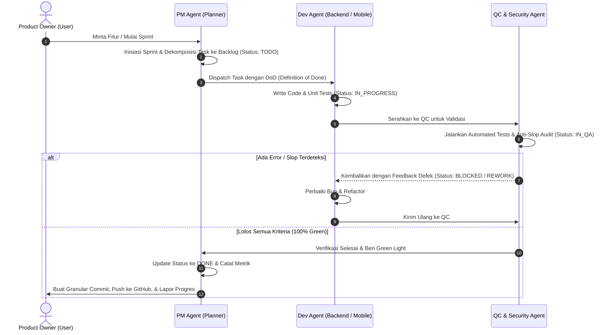

# Project Chronos — Agile Sprint & Backlog Protocol

Dokumen ini mendefinisikan aturan operasional siklus **Agile PM Kanban Loop** bagi seluruh AI Agent dalam ekosistem Project Chronos.

---

## 1. 🔄 Siklus 4-Fase Operasional (PM-Dev-QC-PM Loop)

---

## 2. 📋 Definisi Status Task (Kanban Column States)

| Status | Pemegang Peran | Deskripsi |
| :--- | :--- | :--- |
| `BACKLOG` | **PM Agent** | Daftar seluruh kebutuhan fitur masa depan yang belum dijadwalkan ke sprint aktif. |
| `SPRINT_TODO` | **PM Agent** | Task yang telah dipilih masuk ke Sprint aktif dan siap dikerjakan oleh developer (*Ready for Dev*). |
| `IN_PROGRESS` | **Dev Agent (Backend/Mobile)** | Sedang dalam proses penulisan kode sumber dan pengujian unit lokal. |
| `IN_QA` | **QC / QA Agent** | Sedang dalam proses audit keamanan, verifikasi anti-slop, dan pengujian edge case otomatis. |
| `BLOCKED / REWORK` | **Dev Agent** | Ditemukan kegagalan tes atau pelanggaran aturan kualitas yang harus diperbaiki developer. |
| `DONE` | **PM Agent** | Lolos seluruh kriteria penerimaan, lulus audit QC, ter-commit secara atomik, dan telah di-push ke remote Git. |

---

## 3. 🛡️ Definition of Done (DoD) Wajib

Sebuah task **TIDAK BOLEH** dipindahkan ke status `DONE` sebelum memenuhi seluruh kriteria berikut:
1. **Functional Acceptance**: Memenuhi 100% User Acceptance Criteria (UAC) yang tertera di kartu task.
2. **Automated Testing**: Seluruh unit test lulus (*zero failure*).
3. **Zero AI Slop**: Lolos checklist [`anti-ai-slop.md`](file:///c:/Users/user/Nata/Project/Adaptive%20Lifestyle%20Transition%20System/.agents/rules/anti-ai-slop.md) (bebas emoji, tanpa gradasi klise, tanpa mock palsu).
4. **Defensive Rigor**: Kasus edge (misal *midnight rollover*, *offline sync*) tertangani secara eksplisit.
5. **Git Sync**: Telah dibuat commit atomik dengan format Conventional Commit dan di-push ke GitHub.
